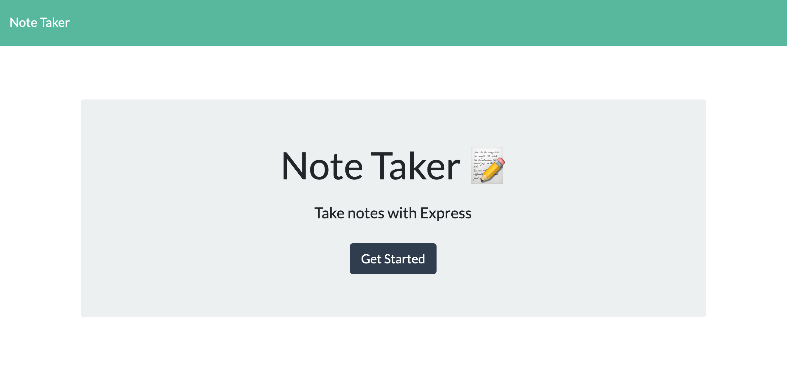
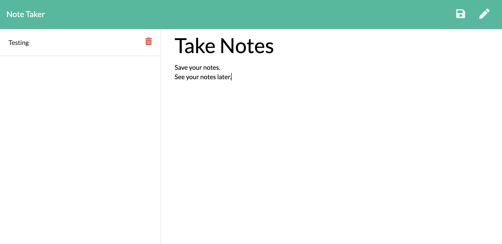

# Note Taker

## Description
This application allows you to take some notes and save them for later. Make a to-do list. Take notes in your class. Remember important information. Note Taker is an easy way to do all of this and more.

- Link: [Use Note Taker Here](https://guarded-hollows-23398.herokuapp.com/)

- Link: [Visit the GitHub Repo Here](https://github.com/kohringsw/note-taker.git)

## Table of Contents
- [Description](#description)
- [Usage](#usage)
- [Contributors](#contributors)
- [Questions](#questions)

## Usage
1. Visit the app site at https://guarded-hollows-23398.herokuapp.com/
2. Click on the "Get Started" button.
3. Create a Note Title.
4. Keep your notes in the note text area.
5. Save your notes using the save button on the top right of your browser. 
6. Access all of your saved notes with the list on the left side of your browser. 

## Contributors
Shelby Kohring

## Questions
If you have questions about this application: 
- Find me on [GitHub: kohringsw](https://github.com/kohringsw) or 
- Email me at [kohringsw@gmail.com](mailto:kohringsw@gmail.com)